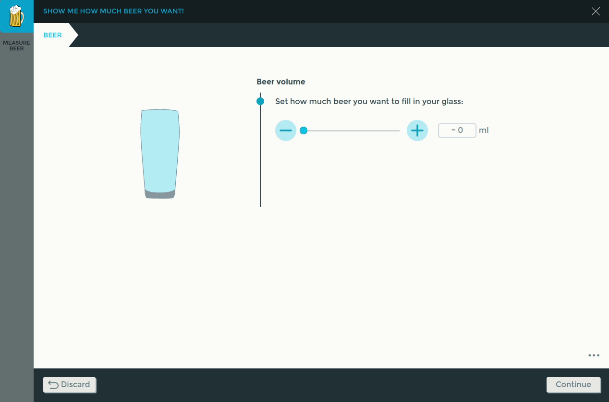

# Measure Beer App
 
## Description
The Measure Beer app can be used to draw beer from a tap: During the execution of the app, it will
monitor the added weight to a beer glass which is held by a Franka Production 3 or Franka Research 3
robot using its integrated sensors.
Once the added weight reaches the weight of the desired beer volume set in the Context Menu, the
execution transitions to the next app of the task.

A possible workflow to draw beer with 2 robots could look like this:
- Robot 1 holds an empty glass and moves such that the glass is positioned underneath the tap
- Robot 2, which operates the tap, waits in position
- Robot 1 sends a signal to Robot 2, that the glass is ready to be filled
- Robot 2 opens the tap
- Robot 1 measures the weight of the beer using the Measure Beer app. Once the glass is full, it
  sends a signal to Robot 2.
- Robot 2 closes the tap
- Robot 1 serves the beer.

The app cannot be used if the robot is in a configuration where a singularity is detected.

## How to install the app on your robot
To be able to install the provided .bundle file, the following preconditions must be met:
- Franka Production 3 with System Version >=5.2.0
- Basic App Package installed on the robot
- App development feature is activated for the robot in Franka World 
- `ride-cli` installed on your computer (available in Franka World)

The app can then be installed as follows:
1. `ride login <robot-ip>`
2. `ride bundle install measure_beer_<systemversion>.bundle`